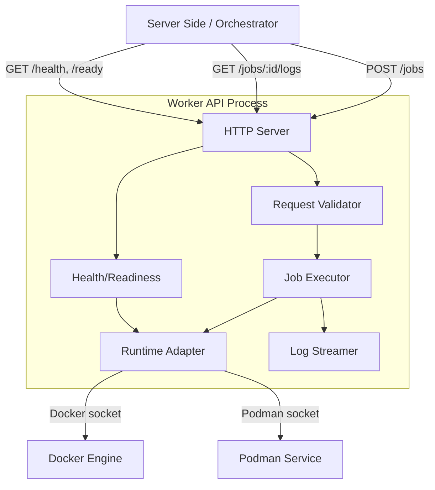
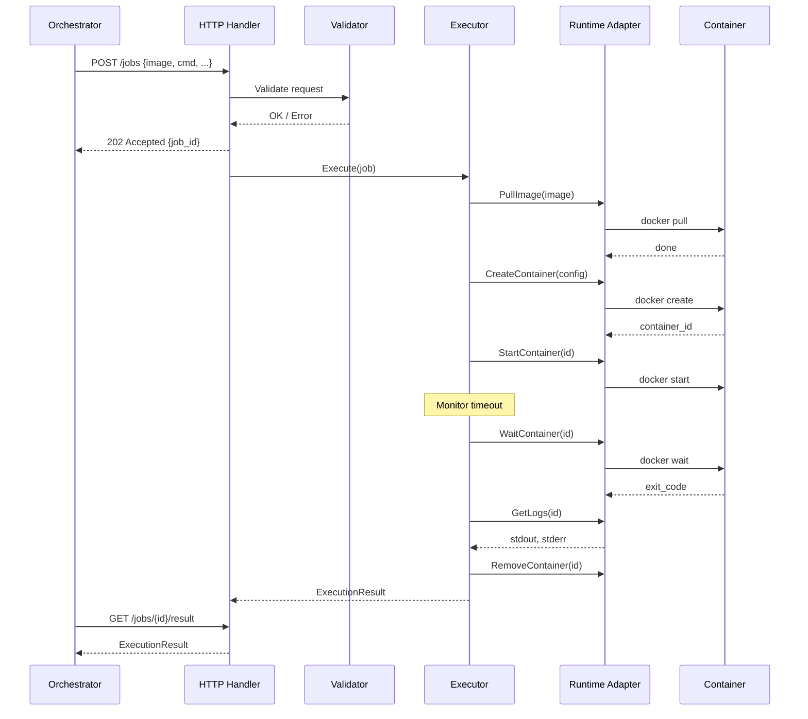
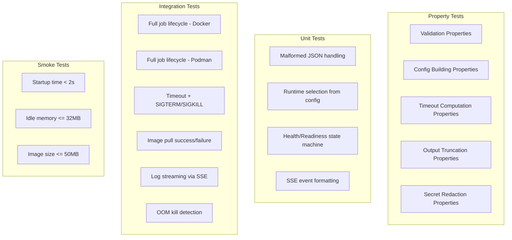

# Design Document: Serverless Worker API

## Overview

The Serverless Worker API is a single-purpose HTTP service written in Go that executes containerized workloads on behalf of an upstream orchestrator. It exposes a minimal REST API for job submission, log streaming, and health/readiness checks, delegates container lifecycle management to Docker or Podman via a unified abstraction, and returns structured execution results.

### Key Design Decisions

1. **Language: Go** — Meets all resource constraints (small binary, fast startup, low idle memory), has mature Docker/container libraries, and compiles to a single static binary ideal for minimal container images.
2. **HTTP Framework: net/http (stdlib)** — No external framework needed. The API surface is small (5-6 routes). Using the standard library keeps dependencies minimal and binary size small.
3. **Container SDK: Docker Engine SDK (`github.com/docker/docker/client`)** — The canonical Go client for Docker. Podman is API-compatible with Docker's REST API, so the same client works for both runtimes by changing the socket path.
4. **Single-job model** — Each worker processes exactly one job at a time. The readiness endpoint signals availability. This simplifies concurrency, resource accounting, and cleanup.
5. **Log streaming: Server-Sent Events (SSE)** — Simpler than WebSocket, works through HTTP proxies, sufficient for unidirectional log delivery.

### Technology Stack

| Concern | Choice |
|---------|--------|
| Language | Go 1.22+ |
| HTTP | `net/http` (stdlib) |
| Container client | `github.com/docker/docker/client` |
| JSON handling | `encoding/json` (stdlib) |
| Logging | `log/slog` (stdlib structured logging) |
| Configuration | Environment variables |
| Container image | `scratch` or `distroless` base |
| Testing | `testing` + `github.com/flyingmutant/rapid` (property-based testing) |

## Architecture



### Request Flow



### Concurrency Model

The worker maintains a single job slot protected by a mutex. When a job is executing:
- The readiness endpoint returns `busy`
- New job submissions are rejected with 409 Conflict
- The executor runs in a goroutine with a context tied to the timeout

## Components and Interfaces

### 1. HTTP Server (`pkg/api`)

Responsible for routing, request parsing, response serialization, and SSE streaming.

```go
// Routes:
// POST   /jobs           - Submit a job
// GET    /jobs/{id}      - Get job result
// GET    /jobs/{id}/logs - Stream logs (SSE)
// GET    /health         - Health check
// GET    /ready          - Readiness check

type Server struct {
    executor *executor.Executor
    addr     string
    server   *http.Server
}

func (s *Server) Start(ctx context.Context) error
func (s *Server) Shutdown(ctx context.Context) error
```

### 2. Request Validator (`pkg/validator`)

Validates job requests against all constraints from Requirement 1.

```go
type ValidationError struct {
    Field   string `json:"field"`
    Message string `json:"message"`
}

func ValidateJobRequest(req *JobRequest, whitelist []string) []ValidationError
func ValidateSecretName(name string) error
func ValidateSecrets(secrets []Secret) []ValidationError
```

### 3. Job Executor (`pkg/executor`)

Orchestrates the full job lifecycle: pull → create → start → monitor → collect → cleanup.

```go
type Executor struct {
    runtime  Runtime
    mu       sync.Mutex
    current  *RunningJob
}

type RunningJob struct {
    ID        string
    Request   *JobRequest
    Result    *ExecutionResult
    LogBuffer *LogBuffer
    Cancel    context.CancelFunc
    Done      chan struct{}
}

func (e *Executor) Submit(ctx context.Context, req *JobRequest) (string, error)
func (e *Executor) GetResult(id string) (*ExecutionResult, bool)
func (e *Executor) IsReady() bool
func (e *Executor) StreamLogs(ctx context.Context, id string, ch chan<- LogLine) error
```

### 4. Runtime Adapter (`pkg/runtime`)

Unified interface for Docker/Podman operations.

```go
type Runtime interface {
    Ping(ctx context.Context) error
    PullImage(ctx context.Context, image string, auth *RegistryAuth) error
    ImageExists(ctx context.Context, image string) (bool, error)
    CreateContainer(ctx context.Context, config *ContainerConfig) (string, error)
    StartContainer(ctx context.Context, id string) error
    WaitContainer(ctx context.Context, id string) (int64, error)
    StopContainer(ctx context.Context, id string, timeout time.Duration) error
    KillContainer(ctx context.Context, id string, signal string) error
    GetLogs(ctx context.Context, id string) (stdout []byte, stderr []byte, error)
    RemoveContainer(ctx context.Context, id string) error
}

type DockerRuntime struct {
    client *client.Client
}

type PodmanRuntime struct {
    client *client.Client // Podman is Docker-API compatible
    socketPath string
}

type ContainerConfig struct {
    Image       string
    Command     []string
    Env         []string
    CPULimit    float64         // fractional cores
    MemoryLimit int64           // bytes
    NetworkOff  bool
    ReadOnlyFS  bool
    User        string          // "1000:1000"
    CapDrop     []string        // ["ALL"]
    Mounts      []Mount         // for file-based secrets
}

type RegistryAuth struct {
    Username string
    Password string
}
```

### 5. Log Streamer (`pkg/stream`)

Captures container output in real-time and delivers it via SSE.

```go
type LogBuffer struct {
    mu      sync.Mutex
    lines   []LogLine
    closed  bool
    notify  chan struct{}
}

type LogLine struct {
    Timestamp time.Time `json:"ts"`
    Stream    string    `json:"stream"` // "stdout" or "stderr"
    Data      string    `json:"data"`
}

func (b *LogBuffer) Write(stream string, data string)
func (b *LogBuffer) Close()
func (b *LogBuffer) Subscribe(ctx context.Context) <-chan LogLine
```

### 6. Health Checker (`pkg/health`)

Verifies runtime connectivity with a timeout.

```go
type Checker struct {
    runtime Runtime
    timeout time.Duration // 3 seconds
}

func (c *Checker) Check(ctx context.Context) HealthStatus
func (c *Checker) IsReady(executor *Executor) ReadinessStatus
```

### 7. Configuration (`pkg/config`)

Loaded from environment variables at startup.

```go
type Config struct {
    ListenAddr        string        // default ":8080"
    Runtime           string        // "docker" or "podman"
    RuntimeSocket     string        // auto-detected or explicit
    RegistryWhitelist []string      // comma-separated list
    DefaultTimeout    time.Duration // 300s
    MaxTimeout        time.Duration // 3600s
    MaxOutputBytes    int64         // 1 MB
    ImagePullTimeout  time.Duration // 120s
}

func Load() (*Config, error)
```

## Data Models

### Job Request

```go
type JobRequest struct {
    Image          string            `json:"image" validate:"required,max=512"`
    Command        string            `json:"command" validate:"required,max=1024"`
    Env            map[string]string `json:"env,omitempty"`
    Secrets        []Secret          `json:"secrets,omitempty"`
    TimeoutSeconds *int              `json:"timeout_seconds,omitempty"`
    CPULimit       *float64          `json:"cpu_limit,omitempty"`
    MemoryLimitMB  *int              `json:"memory_limit_mb,omitempty"`
    NetworkAccess  bool              `json:"network_access"`
    StreamLogs     bool              `json:"stream_logs"`
    RegistryAuth   *RegistryAuth     `json:"registry_auth,omitempty"`
}

type Secret struct {
    Name     string  `json:"name" validate:"required,max=256"`
    Value    string  `json:"value" validate:"required,max=65536"` // 64KB
    FilePath *string `json:"file_path,omitempty"` // if set, mount as file
}
```

### Execution Result

```go
type ExecutionResult struct {
    JobID           string `json:"job_id"`
    Status          string `json:"status"` // "success", "failed", "timeout", "error"
    ExitCode        *int   `json:"exit_code,omitempty"`
    Stdout          string `json:"stdout"`
    Stderr          string `json:"stderr"`
    StdoutTruncated bool   `json:"stdout_truncated"`
    StderrTruncated bool   `json:"stderr_truncated"`
    DurationMs      int64  `json:"duration_ms"`
    Error           string `json:"error,omitempty"`
}
```

### Health/Readiness Responses

```go
type HealthStatus struct {
    Status  string `json:"status"` // "healthy" or "unhealthy"
    Runtime string `json:"runtime,omitempty"` // connectivity detail
}

type ReadinessStatus struct {
    Status string `json:"status"` // "ready" or "busy"
    JobID  string `json:"job_id,omitempty"` // current job if busy
}
```

### SSE Log Event

```
event: log
data: {"ts":"2024-01-15T10:30:00Z","stream":"stdout","data":"Hello world\n"}

event: end
data: {"status":"success","exit_code":0}
```


## Correctness Properties

*A property is a characteristic or behavior that should hold true across all valid executions of a system — essentially, a formal statement about what the system should do. Properties serve as the bridge between human-readable specifications and machine-verifiable correctness guarantees.*

### Property 1: Valid requests pass validation

*For any* `JobRequest` with image reference (1-512 chars, from a whitelisted registry), command (1-1024 chars), env vars (0-64, key ≤256 chars, value ≤4096 chars), timeout (1-3600s), CPU (0.1-4.0), memory (16-8192 MB), and valid secrets (0-64, name matching `[A-Z_][A-Z0-9_]*` ≤256 chars, value ≤64 KB), the validator SHALL return zero validation errors.

**Validates: Requirements 1.1, 1.2**

### Property 2: Missing required fields produce 400 errors

*For any* `JobRequest` where image reference is empty/missing OR command is empty/missing, the validator SHALL return at least one validation error identifying the missing field(s) by name.

**Validates: Requirements 1.3**

### Property 3: Non-whitelisted registries are rejected

*For any* image reference whose registry component is not present in the configured Registry_Whitelist, the validator SHALL return a registry rejection error.

**Validates: Requirements 1.4**

### Property 4: Out-of-range fields produce specific errors

*For any* `JobRequest` where at least one numeric field (timeout, CPU limit, or memory limit) is outside its valid range, the validator SHALL return a validation error identifying the invalid field and its acceptable range.

**Validates: Requirements 1.5**

### Property 5: Container config enforces security invariants and maps resources correctly

*For any* valid `JobRequest`, the generated `ContainerConfig` SHALL have: User with UID ≥ 1000, ReadOnlyFS set to true, CapDrop containing "ALL", CPULimit matching the request CPU limit, MemoryLimit equal to request memory_limit_mb × 1048576, NetworkOff equal to the negation of the request network_access flag, Command matching the request command, and all request env vars present in the config Env list.

**Validates: Requirements 2.2, 2.3, 2.4, 2.5, 2.6, 2.7, 2.8**

### Property 6: Effective timeout computation

*For any* `JobRequest`, the effective timeout SHALL be: the request's timeout_seconds if provided and ≤ 3600, 3600 if the request specifies a value > 3600, or 300 if no timeout is specified.

**Validates: Requirements 3.4, 3.5**

### Property 7: Output tail truncation

*For any* byte stream of length N: if N ≤ 1048576 (1 MB), the captured output SHALL equal the full stream and the truncation flag SHALL be false; if N > 1048576, the captured output SHALL equal the last 1048576 bytes of the stream and the truncation flag SHALL be true.

**Validates: Requirements 4.2, 4.3**

### Property 8: Secret injection produces correct container config

*For any* set of valid secrets in a `JobRequest`: each secret without a file_path SHALL appear as an environment variable in the ContainerConfig (name=value), and each secret with a file_path SHALL appear as a read-only mount in the ContainerConfig at the specified path.

**Validates: Requirements 7.1, 7.3**

### Property 9: Secret validation rejects invalid names and exceeding limits

*For any* string that does not match the pattern `^[A-Z_][A-Z0-9_]{0,255}$`, the validator SHALL reject it as an invalid secret name. *For any* job request with more than 64 secrets OR any secret value exceeding 65536 bytes, the validator SHALL return a validation error.

**Validates: Requirements 7.2, 7.6**

### Property 10: Secret redaction removes all secret values from output

*For any* output string and any set of secret values, applying the redaction function SHALL produce a result that contains none of the original secret values as substrings, and any former secret occurrence SHALL be replaced by the redaction placeholder.

**Validates: Requirements 7.4**

## Error Handling

### Error Categories

| Category | HTTP Status | Description |
|----------|-------------|-------------|
| Validation Error | 400 | Malformed request, missing fields, out-of-range values |
| Registry Denied | 403 | Image from non-whitelisted registry |
| Worker Busy | 409 | Job already executing, cannot accept new work |
| Execution Error | 200 (in result) | Container failed to start, pull failed, secret injection failed |
| Timeout | 200 (in result) | Job exceeded timeout — status "timeout" |
| Internal Error | 500 | Unexpected server error |

### Error Response Format

```json
{
  "error": {
    "code": "VALIDATION_ERROR",
    "message": "Request validation failed",
    "details": [
      {"field": "timeout_seconds", "message": "must be between 1 and 3600"}
    ]
  }
}
```

### Error Handling Strategies

1. **Validation errors** — Return immediately with 400/403 before any runtime interaction.
2. **Image pull failures** — Set ExecutionResult status to "error" with pull failure details. Clean up any partial state.
3. **Container start failures** — Set ExecutionResult status to "error" with start failure reason. Remove any created container.
4. **Timeout** — SIGTERM → 10s grace → SIGKILL. Capture partial output. Set status "timeout". Remove container.
5. **OOM kill** — Container killed by cgroup. Detect via exit code 137 or OOM event. Set status "failed" with OOM indicator in error field. Remove container.
6. **Secret injection failure** — Abort before container start. Set status "error" with reason (without revealing secret value).
7. **Runtime unreachable during execution** — Context will error. Set status "error". Attempt cleanup best-effort.

### Cleanup Guarantee

Every code path through the executor MUST remove the container (force remove) in a `defer` block after creation. This prevents container leaks regardless of success, failure, timeout, or panic.

### Secret Safety

- Secret values are NEVER written to logs (use `slog` with a custom handler that filters known secret keys).
- Secret values are NEVER included in ExecutionResult — apply redaction before building the result.
- Secret values are NEVER stored on disk (env-var secrets are in-memory only; file-based secrets use tmpfs mounts that are removed with the container).

## Testing Strategy

### Testing Layers



### Property-Based Testing

**Library:** `github.com/flyingmutant/rapid` (Go property-based testing library)

**Configuration:** Minimum 100 iterations per property test.

**Tag format:** Each property test function includes a comment: `// Feature: serverless-worker-api, Property N: <title>`

Properties to implement:

| Property | Module Under Test | Key Generators |
|----------|-------------------|----------------|
| 1: Valid request acceptance | `pkg/validator` | Random valid JobRequests |
| 2: Missing fields rejection | `pkg/validator` | JobRequests with nil image/command |
| 3: Registry whitelist | `pkg/validator` | Random registries + whitelists |
| 4: Out-of-range rejection | `pkg/validator` | Out-of-range numeric values |
| 5: Config security invariants | `pkg/executor` | Valid JobRequests → ContainerConfig |
| 6: Timeout computation | `pkg/executor` | Optional timeouts, extreme values |
| 7: Output truncation | `pkg/executor` | Random byte streams (0 to 5 MB) |
| 8: Secret injection config | `pkg/executor` | Valid secrets with/without file_path |
| 9: Secret validation | `pkg/validator` | Random strings, oversized payloads |
| 10: Secret redaction | `pkg/executor` | Random output + embedded secrets |

### Unit Tests (Example-Based)

- Malformed JSON request → 400 with format error
- Runtime config "docker" → DockerRuntime instance
- Runtime config "podman" → PodmanRuntime instance
- Runtime config "invalid" → startup error
- Readiness: no job → "ready"; during job → "busy"; after job → "ready"
- SSE event serialization format
- End-of-stream event structure

### Integration Tests

Run with a real Docker daemon (CI uses Docker-in-Docker):

1. **Happy path**: Submit job with `alpine` image, `echo hello`, verify stdout = "hello\n", status = "success"
2. **Failed exit**: Run `sh -c "exit 42"`, verify exit_code = 42, status = "failed"
3. **Timeout**: Run `sleep 600` with timeout = 2s, verify status = "timeout", SIGTERM then SIGKILL
4. **OOM**: Run memory-intensive command with low limit, verify failure
5. **Network isolation**: Run `ping -c 1 8.8.8.8` with network_access = false, verify failure
6. **Private registry auth**: Pull from authenticated registry with correct/missing credentials
7. **Log streaming**: Enable streaming, connect to SSE, verify labeled lines arrive, verify end-of-stream
8. **Image not found**: Reference non-existent image, verify error result
9. **Concurrent submission**: Submit while busy, verify 409 response

### Smoke Tests (CI Pipeline)

- Build image, verify compressed size ≤ 50 MB
- Start worker, measure time to first healthy response ≤ 2s
- After startup, measure idle RSS ≤ 32 MB
- Run a trivial job, measure idle RSS 5s after completion ≤ 32 MB
